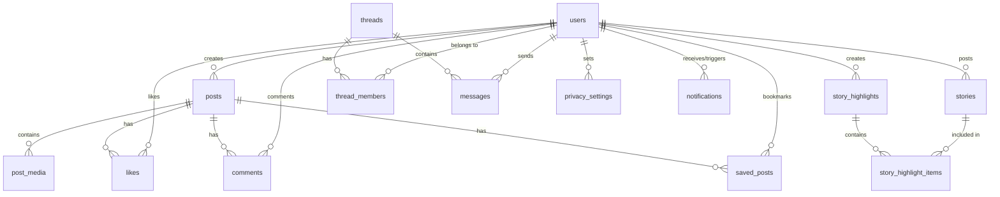

# ULink Social Media Platform

Welcome to **ULink**, a comprehensive, full-stack, real-time social media application. I built ULink to deliver a lightweight, high-performance, and feature-rich social experience featuring multimedia posts, reels, disappearing stories, highlights, custom privacy settings, direct messaging, and live notifications.

The entire platform is built with a focus on raw performance and native web capabilities. The backend is powered by Node.js and Express, while the frontend is constructed using pure vanilla HTML5, CSS3, and JavaScript, completely eliminating heavy frontend framework dependencies for ultra-fast, responsive load times.

---

## 🌟 Core Features

I have implemented a wide range of social features to simulate a fully production-ready, interactive environment:

### 1. Multimedia Posts & Reels
* **Multi-Media Carousel**: Share multiple images or videos in a single post with horizontal sliding capabilities.
* **Image Filters**: Apply CSS-based filters (e.g., normal, grayscale, sepia, etc.) during creation.
* **Location Tags**: Tag posts with physical locations.
* **Reels**: Support for dedicated short-form video sharing.

### 2. Disappearing Stories & Highlights
* **Active Stories**: Share photos or videos with text overlays that automatically expire in exactly 24 hours.
* **Story Highlights**: Curate and group past stories into permanent highlights on your profile with custom titles and cover images.

### 3. Relationships & Profile Management
* **Follow System**: Complete relationship management, including Private vs. Public profile modes.
* **Pending Requests**: Private accounts require manual approval of incoming follow requests.
* **Interactive Profiles**: Edit bios, update profile pictures, and view dedicated grids for your posts, reels, and saved bookmarks.

### 4. Granular Privacy & Moderation Controls
* **Close Friends**: Restrict specific stories so only users on your Close Friends list can see them.
* **Block & Unblock**: Immediately sever all follow connections and hide your profile/activity from blocked users.
* **Comment Restricting**: Restrict specific users so their comments are only visible to themselves and you (the post owner) until approved.
* **Mute Feed**: Mute posts or stories of specific users to hide them from your feed without unfollowing.

### 5. WebSocket-Powered Direct Messaging (DMs)
* **Real-Time Delivery**: Instantly send and receive messages with low latency.
* **Group Chats**: Start multi-user conversations with custom names.
* **Rich Media Sharing**: Send text, images, videos, or recorded voice notes.
* **Read Receipts & Reactions**: Live delivery statuses, read ticks, and emoji reactions on individual messages.

### 6. Live Activity Notifications
* **Immediate Alerts**: Real-time notifications for new likes, comments, and follow events.
* **Unread Counters**: Live badges showing your unread notification count.

---

## 🛠️ Architecture & Tech Stack

Project is structured using a clean, separation-of-concerns architecture to keep it maintainable, scalable, and lightweight:

### Backend Architecture
* **Node.js & Express**: Fast, minimalist routing engine for serving API endpoints and static SPA files.
* **SQLite3 (ACID-Compliant)**: A lightweight, embedded relational database. Database actions are promisified into helper functions (`dbAll`, `dbGet`, `dbRun`) to keep the codebase elegant and async-friendly.
* **WebSockets (`ws`)**: Hand-crafted real-time state engine managing live connections, broadcasting messages, read receipts, and user reactions dynamically.
* **Multer**: Multi-part upload parser handling file streams for avatars, post media, and direct messaging attachments.
* **Authentication**: Cookie-based JSON Web Tokens (JWT) coupled with secure `bcryptjs` password hashing.

### Frontend Architecture
* **Vanilla Single Page Application (SPA)**: Hand-rolled client router managing views dynamically without reloading.
* **CSS3 Custom Variables**: A custom, modern design system featuring smooth transitions, rounded cards, dark aesthetics, and glassmorphism styling.
* **Vanilla JS State Manager**: Structured client-side state handling that communicates seamlessly with the Express REST API and the WebSocket connection.

---

## 📊 Database Schema

A highly organized relational database schema to support these advanced social interactions. Here is a diagram representing how the tables link together:



### Table Definitions:
* **`users`**: Profiles storing usernames, emails, hashed passwords, full names, bio content, privacy status, and custom avatars.
* **`follows`**: Join-table tracking relationships (`follower_id`, `following_id`) and statuses (`accepted` or `pending`).
* **`posts`**: Core post metadata including descriptions, location tags, and post types (`post` or `reel`).
* **`post_media`**: Multi-item attachments for posts, specifying media types (images/videos), CSS filter configurations, and sequential layout indexes.
* **`likes` & `comments`**: User engagement tables. Comments support a `parent_id` self-reference to facilitate nested reply threads.
* **`stories`**: Content with built-in auto-expiration stamps (`expires_at`) mapped exactly 24 hours after creation.
* **`story_highlights` & `story_highlight_items`**: Mappings to persist selected expired stories into custom-themed collections.
* **`threads`, `thread_members`, & `messages`**: Multi-layered real-time messaging entities supporting text, attachments, voice clips, read states, and custom emoji reactions.
* **`privacy_settings`**: Highly custom access control configurations managing blocks, mutes, restrictions, and close friends tags between users.
* **`notifications`**: Live-trigger records capturing social interactions for direct broadcast.

---

## 🚀 Installation & Local Setup

To get ULink running locally on your environment, follow these straightforward steps:

### Prerequisites
Make sure you have [Node.js](https://nodejs.org/) installed (v16.0.0 or higher is recommended).

### Steps
1. **Clone the project files** to your local workspace directory.
2. **Open your terminal** inside the root directory and install all required dependencies:
   ```bash
   npm install
   ```
3. **Start the local Express server**:
   * For production launch:
     ```bash
     npm start
     ```
   * For active developer testing:
     ```bash
     npm run dev
     ```
4. **Access the application**:
   Open your web browser and navigate to:
   ```
   http://localhost:3000
   ```

---

## 🧠 Architectural Insights & Decisions

During the development of this project, I made several deliberate engineering trade-offs to keep the stack simple but extremely robust:
1. **Why Vanilla JavaScript?** Frameworks like React/Vue bring build-step complexity and large bundle sizes. I wanted to showcase how lightweight a complex social network can feel when written in modular, optimized Vanilla JS that manipulates the DOM directly.
2. **Why SQLite?** Rather than setting up heavy database containers like Postgres or MySQL, SQLite stores the entire relational structure in a single local file (`database.db`). This makes deployment and local testing incredibly painless while preserving full relational features (foreign keys, transaction guarantees, and structured indexing).
3. **WebSocket Connection Pool**: Instead of using third-party libraries, I wrote a custom WebSocket message router. Each client connection is verified via JWT cookies and cached in an active memory map, allowing instant and secure messaging, typing indicator updates, reactions, and real-time read-state triggers.
